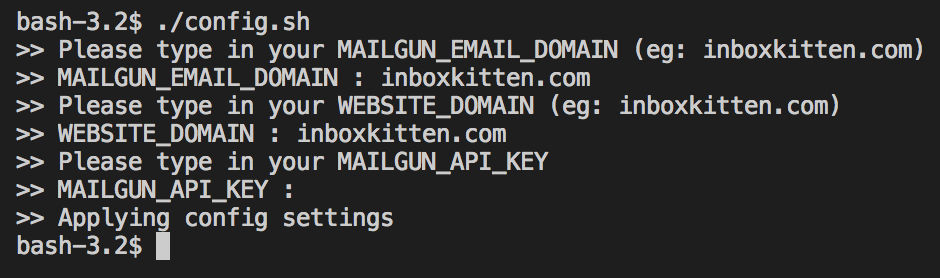

# Serverless Deployment Guide

Follow the 5 steps guide below to get started on Firebase!

- [Step 0 - Clone Me](#step-0---clone-me)
- [Step 1 - Setup Serverless provider](#step-1---mailgun--firebase-signup)
- [Step 2 - Configuration](#step-2---configuration)
- [Step 3 - Build the package](#step-3---build-the-package)
- [Step 4 - Deployment](#step-4---deployment)

> Also do let us know how we can help make this better 😺

## Step 0 - Clone Me

```
	$ git clone https://github.com/uilicious/inboxkitten.git
```

### Step 1a - Setup Firebase

1. Go to <a href="https://firebase.google.com" target="_blank">Firebase</a> and click on `Get Started`.
2. Sign in with your favorite Google account.
3. Click on `Add Project` and create your own firebase inboxkitten project.
4. Remember the project ID  

On your local machine where your InboxKitten is located at,
```
	# Go to the root folder of InboxKitten
	$ cd <the place where you clone your inboxkitten>
	
	# Ensure that firebase CLI tool is installed
	$ npm install -g firebase-tools
	
	# Login to your firebase account
	$ firebase login
	
	# Set your firebase project
	$ firebase use --add <project name that you remembered>
```

OR

### Step 1b - Setup Cloudflare Workers

1. Go to <a href="https://cloudflare.com" target="_blank">Cloudflare</a> and signup with a domain.
2. Setup cloudflare worker and get an API key
___

## Step 2 - Configuration

In the root directory of Inboxkitten, run the following command
```
	$ ./config.sh
```

During the run time of `./config.sh`, there are three environment variables that is being used to set the configuration for your configuration files.

1. `MAILGUN_EMAIL_DOMAIN` - any custom domain that you owned or the default domain in Mailgun
2. `WEBSITE_DOMAIN`  - any custom domain that you owned. If you use your default firebase url, it will be `<Your project>.firebaseapp.com`
3. `MAILGUN_API_KEY` - retrieve the api key from your Mailgun account



___

## Step 3 - Build the package

```
	$ ./build.sh
```

`./build.sh` will package the three components to be ready for deployment.

___

## Step 4 - Deployment

For API deployment on Firebase:

```
	# Run the deployment script
	$ ./deploy/firebase/deploy.sh 
```

For API deployment on Cloudflare:

```
	# Run the deployment script
	$ ./deploy/cloudflare/deploy.sh 
```