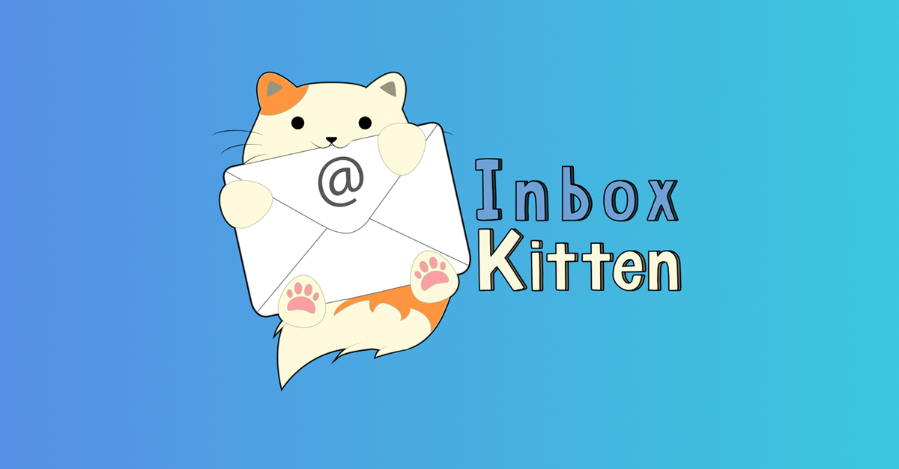
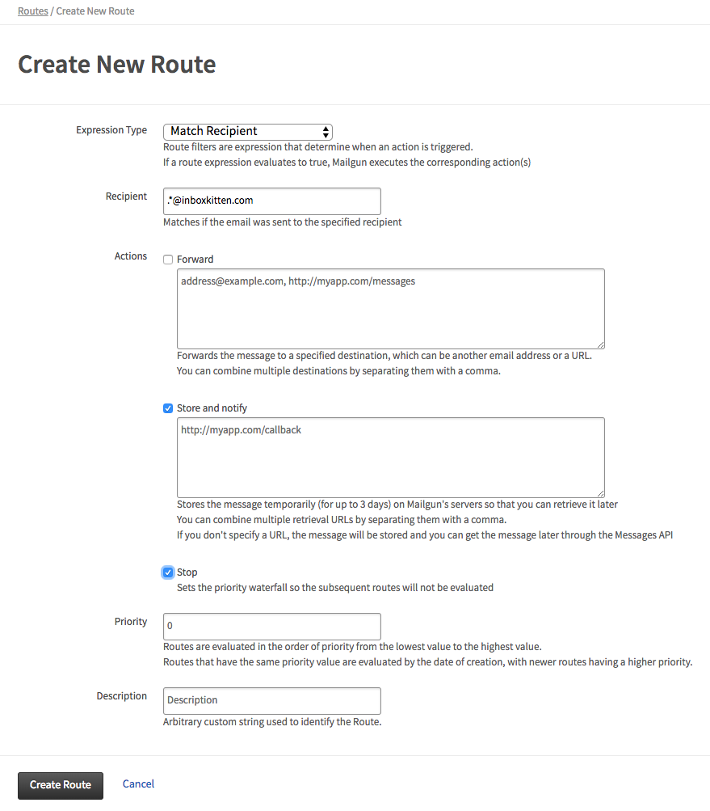
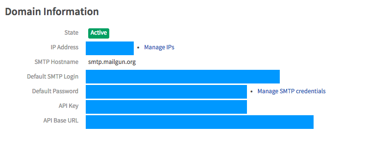
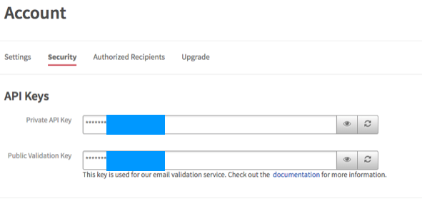

[](https://inboxkitten.com)

# Open-Source Disposable Email - Served by Serverless Kittens

[](https://travis-ci.org/uilicious/inboxkitten)

[Inboxkitten](https://inboxkitten.com) is an open-source disposable email service that you can freely deploy adopt on your own!

Visit [our site](https://inboxkitten.com) to give a spin, or ...

# Docker Deployment Guide

Its one simple line - to use our prebuilt docker container.

Note you will need to [setup your mailgun account first](#setup-mailgun)

```
# PS: you should modify this for your use case
docker run \
	-e MAILGUN_EMAIL_DOMAIN="<email-domain>" \
	-e MAILGUN_API_KEY="<api-key>" \
	-e WEBSITE_DOMAIN="localhost:8000" \
	-p 8000:8000 \
	uilicious/inboxkitten
```

And head over to port 8000 - for your inboxkitten

# Other Deployment Options

- [Serverless deployment guide (for cloudflare/firebase)](./DEPLOY-GUIDE-SERVERLESS.md)
- [localhost/custom deployment/configuration guide](./DEPLOY-GUIDE-LOCALHOST)

# Support us on product hunt 🚀

+ https://www.producthunt.com/posts/inboxkitten

# Somewhat related blog / articles

+ [The Stack : Making a free open-source disposable email service prototype (inboxkitten.com) in 14 hours](https://dev.to/picocreator/the-stack-making-a-free-open-source-disposable-email-service-prototype-inboxkittencom-in-14-hours-206g)
+ [What I have learnt from a 14 hours project](https://dev.to/jmtiong/what-i-have-learnt-from-a-14-hours-project-2joo)
+ [Development timeline](https://blog.uilicious.com/development-timeline-for-inboxkitten-com-lessons-learnt-e802a2f0a47c)

# Other References

- [Coding Guide](./CODE-GUIDE.md)

# Looking for sponsor

Note: Due to this project rather heavy traffic usage, a good half sadly spam/bot related, we are looking for a hosting sponsor / sponsor to subsidise running cost
___

## How to Setup Mailgun - and get your free API key

### Mailgun
To sign up for a Mailgun account, go to the <a href="https://signup.mailgun.com/new/signup" target="_blank">signup</a> page.

> 2021 Udpate: Inbound routing for mailgun, now requires any paid account (starting at $35/month) see : https://www.mailgun.com/pricing/

#### Custom Domain
```
	1. Click on `Add New Domain` button under your Domains panel. 
	2. Follow the steps accordingly
```
> You can use the default domain that was provided by Mailgun if you do not have your own domain.

#### Routes Configuration
After setting up your domain, in order for you to receive email, you have to configure the routes. <a href="https://documentation.mailgun.com/en/latest/quickstart-receiving.html" target="_blank">Routes</a> act as rules that will filter through all the incoming mails and execute actions on matched conditions.

In your Routes panel, simply click on `Create Route` button and follow the steps accordingly.



> The above route will match all names ending with `@inboxkitten.com`, store them in the storage that mailgun provides (only for 3 days) and stop processing any other rules once this route is matched. 

#### Mailgun API Key
You can locate your Mailgun API key by clicking on the domain that you are managing. In it you can see your API key.



Or you can go to the security settings and locate the API key there.



___
